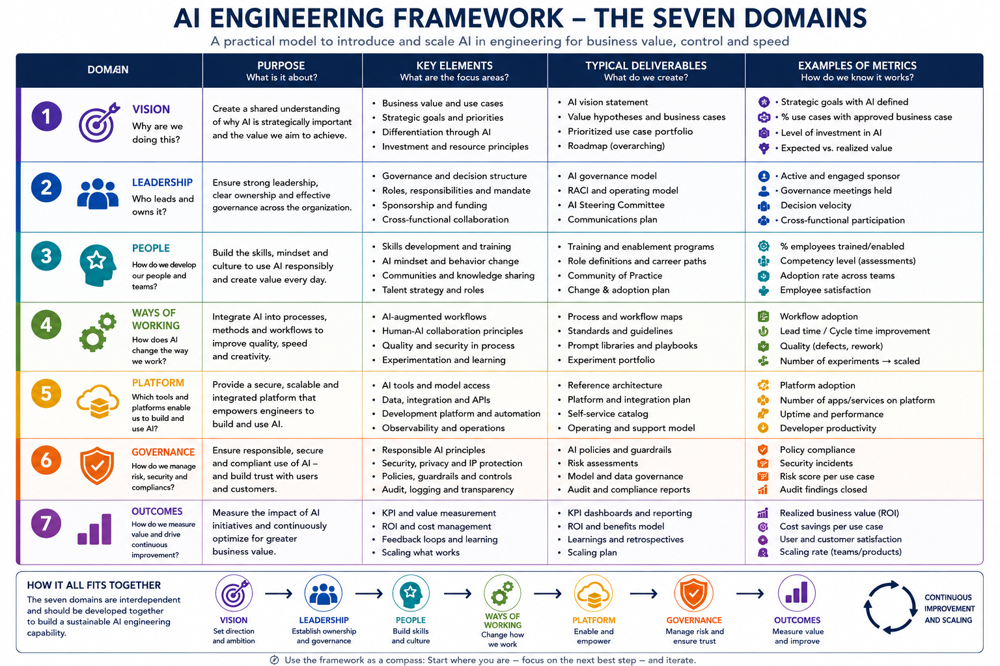

# 02 - Engineering in the Age of AI

## The Engineering Transformation
[TODO] Engineering has fundamentally changed. The role of the engineer is no longer just to code—it's to architect, orchestrate, and oversee AI systems. To accomplish adoption of the new paradigm I decided to go two ways throughout this book, a clear model for reference and a maturity level model to support organisations identify and manage this transformation. Why at all write about this, dont we soon have agents and AI to deal with it all? I obviously disagree, I think we need to clarify what we want, control and manage it all along, not least to be ready for when it doesn't, yes I used for when, not if, as amazing as AI and ML can feel, we must know that it continues to deliver the value we're looking for. Many others describe how to build a fantastic solution with MCP, stellar A2A collaboration that makes any process a breeze. This book and the framework I suggest is about the transformation that enables these many different opportunities and make it possible, whether in a regulated enterprise setup, a startup, an IT house, consultancy or any other business or organization looking to architect, control and manage AI Engineering. [TODO: round it off]

## The Framework
Lets get into this, the methods are first put simple here, to get you comfortable with the idea and how you can use this. It's not a static method or way of doing this, Enterprises can differ, some are highly regulated maybe critical infrastructure, others are not, some might be operating in countries where regulations and legislation are particularly focusing on AI and how it is being applied. No one size fit all here - take it and make it yours, this is a recipe, but you can adjust, add or remove where it makes sense. Below you can find how first the steps are outlined, what principles to apply, the practices, the how part, and then how we measure what we've built and introduced.
Further down is the maturity levels, I personally believe this is a good way to quickly communicate how far we are and something to help us gage what is next. It takes the approach from a value perspective, not an engineering or AI technology point of view, but focuses instead on the journey and the value we want from this transformation - so if you're in Engineering thinking this is not for me, maybe give it a chance - understanding the process can support your journey and ensure better transparency between top management, middle management and those actually engineering the solutions. What we also have to keep focus on is the customer, whether internal teams or actual paying customers. It must be clear to all involved why we're building a solution.

I also created principles and guidance based on 7 domains in an enterprise that I believe are key to be successful on the mission to do a full transformation. But can also be used in the context of any AI project really.

So in short this is not a book about AI, its a book about how to make the transformation journey in an enterprise setup to become an Engineering team powered with AI.

In the next chapters I'll go through the various phases first in the Adoption plan and at the same time show how the domains are closely related to the different processes

Along the way I'll present different research on the topic, I'll add my experiences to the mix and we will explore different setups. In 2026 72% of Enterprises asked were somewhat in the process of introducing Agentic AI but only 21% of those have a mature agent-governance model in place. These are at the time of writing probably already on their way to reach a more mature level. Meanwhile lets look at some other stats from 2026:
- 45% of AI generated Code fra 100+ tested LLM's introduce OWASP Top-10 vulnarbilities - this has been the same for the past 2 years.
- 70% of 273 engineering leaders said application quality has dropped! 60% of those has experienced regressions and problems, simply because code was written fast and test wasnt added on top.
- AI Generated code introduces on average 1.7 times more issues than human written code in production systems.
- 92% of Engineers today use AI in their daily jobs creating code, but only 29% of those trust the code the AI is producing.

These are some examples from my research, the common pattern for them is that AI is not perfect, without a structured approach to introducing and using these otherwise powerful tools, there is risk, we will look closer at how to mitigate these and ensure that it stays in good quality and improves itself along the way.

 