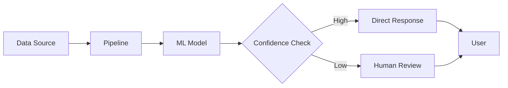
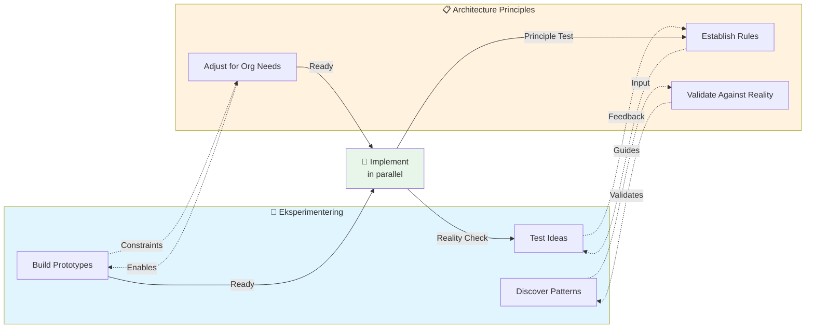

# 03 - AI-First Engineering

## What AI-First Means
AI-first engineering is not about adding a model to an existing product. It means designing systems, workflows, and teams with AI capabilities as a core assumption. Traditional engineering is know for inherently difficulties estimating work, lack of solid quality and an overburden engineering staff. Whether part of a multinational highly regulated enterprise, a small start up, all engineers working to create value either internally or in a SaaS setup can benefit from introducing AI, not to replace teams, rather enforce them and take the tedious and often troublesome tasks out of the way. This is enabling different skills to add equally to the final output, it removes barriers from junior developers and enables senior and principal staff to go above and beyond. Most teams I've worked with had a natural skepticism towards introducing AI to their specific area, often accompanied with the believe that AI would sidetrack quality, produce too much noise or bad code, not be sufficent at the end of the day because naturally the time would now be spend reviewing errornous code and problematic bugs. This is to some extend true, when and if teams skip the important journey in between no AI to Full autonoumos AI. It may sound simple and obvious but it isnt especially the what and the how requires the entire team to discuss, create a plan and not least the plan about how to maintain the new AI Developer team. For management its important not to rush it, or demand immediate affects. Management need to commit to budget and spendings also for a future setup. As the LLM frontier models might be cheaper to produce running them as services is a different matter these days. this can infer significant cost and while each engineer can scale vertically the cost for the AI engineers will increase as their workloads grow. Becoming AI First is not trivial or cheap, it may even require multiple attempts to get it right - now that I mentioned getting it right what does that really mean? It starts with the business objective in mind, e.g. we want to enable customers (internal and/or external) to do the best with our solution, then first step is to put a plan in place, the plan must contain quality gates, budgets, control, governance and testing. Then start small, let the initiatives be demo driven, let engineers show and tell, have a Program Manager be on point to keep track of progress, demos, next steps etc. treat it like any other critical project. When we fail to acknowledge the risk and see it more like an innovation problem, we soon hit roadblocks, budget constraints, the bugs you will find and discover will suddenly be motivational blockers for continuing the work. Only by incrementally implementing and adjusting a plan will the process succeed. Will it succeed and why? its not a given but in all my own experience there is value to be gained, engineers will gradually embrace the capabilities of their Agents, they'll discover that unit testing can now be done in minutes, mocking data sources, creating threatmodels and Governance work is now handled and no longer takes away important time from the core task and team, hence bumping the value and quality. lets look at the breakdown below:  

## Architecture Principles

The foundation of AI-first engineering rests on four core principles. Each principle must be established from day one and constantly validated against real-world constraints.

### 1. Data Quality
Treat data quality as a product concern, not an afterthought.
- Shit in → shit out. Your data is core to everything.
- Establish clear data validation pipelines
- Monitor data quality metrics continuously
- [TODO] Define data quality SLAs

### 2. Observability
Design for observability from day one—transparency is essential to understand if you're getting what you're paying for.
- **Model Performance Monitoring**: Accuracy, throughput, model drift
- **Input/Output Logging**: Track all data flowing to/from the model (debugging + compliance)
- **Error Tracking**: Capture failures, exceptions, edge cases where the model fails
- **Inference Tracing**: See the entire chain—API calls, pipeline steps, dependencies
- **Token/Cost Tracking**: FinOps is critical. AI adoption is not cheap.

### 3. Separation of Concerns
Keep model iteration independent from application release cycles.
- [TODO] Define the boundaries between experimentation and production
- Enable rapid model updates without full application redeployment
- Build versioning strategy for models

### 4. Resilience & Fallback Behavior
Build fallback behavior for model uncertainty—AI will sometimes respond incorrectly or unexpectedly.

**Practical Implementation:**
1. **Confidence Thresholds** — Define safety limits (e.g., 80%). Below threshold = trigger fallback
2. **Graceful Degradation** — Don't fail silently. Fallback options:
   - Escalate to human reviewer
   - Use rule-based fallback
   - Add telemetry for analysis [TODO]
3. **Uncertainty Quantification** — Use techniques like:
   - Prediction intervals
   - Bayesian approaches
   - Ensemble methods (run multiple models to detect inconsistency)
4. **Tiered Responses** — Design for uncertainty:
   - **High confidence** → Use AI answer directly
   - **Medium confidence** → Use AI answer + warning tag
   - **Low confidence** → Escalate to human or fallback system
5. **Uncertainty Logging** — Track how often fallback triggers. Frequent triggers = potential model drift

**Important:** Principles alone don't work. Principles in isolation from reality become discussion points rather than propel teams forward. They must evolve with your team's maturity and support the process of building enterprise-ready AI tools efficiently.

## Experimentation & Principles: An Intertwined Journey

The path to AI-first engineering isn't linear—architecture principles and team experimentation work in tandem. Principles guide experimentation, but experimentation also refines and validates those principles to fit organizational reality.

## Team Model
A high-performing AI-first organization combines:
- Product and domain context
- Data and ML expertise
- Platform engineering excellence
- Responsible AI practices

## Delivery Model
### Discover
Identify high-value use cases and define success metrics.

### Prototype
Validate feasibility quickly with constrained experiments.

### Industrialize
Harden pipelines, automate evaluation, and integrate controls.

### Operate
Monitor cost, quality, drift, and user impact continuously.
