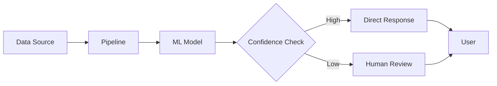

# 03 - AI-First Engineering

## What AI-First Means
AI-first engineering is not about adding a model to an existing product. It means designing systems, workflows, and teams with AI capabilities as a core assumption. Traditional engineering is know for inherently difficulties estimating work, lack of solid quality and an overburden engineering staff. Whether part of a multinational highly regulated enterprise, a small start up, all engineers working to create value either internally or in a SaaS setup can benefit from introducing AI, not to replace teams, rather enforce them and take the tedious and often troublesome tasks out of the way. This is enabling different skills to add equally to the final output, it removes barriers from junior developers and enables senior and principal staff to go above and beyond. Most teams I've worked with had a natural skepticism towards introducing AI to their specific area, often accompanied with the believe that AI would sidetrack quality, produce too much noise or bad code, not be sufficent at the end of the day because naturally the time would now be spend reviewing errornous code and problematic bugs. This is to some extend true, when and if teams skip the important journey in between no AI to Full autonoumos AI. It may sound simple and obvious but it isnt especially the what and the how requires the entire team to discuss, create a plan and not least the plan about how to maintain the new AI Developer team. For management its important not to rush it, or demand immediate affects. Management need to commit to budget and spendings also for a future setup. As the LLM frontier models might be cheaper to produce running them as services is a different matter these days. this can infer significant cost and while each engineer can scale vertically the cost for the AI engineers will increase as their workloads grow. Becoming AI First is not trivial or cheap, it may even require multiple attempts to get it right - now that I mentioned getting it right what does that really mean? It starts with the business objective in mind, e.g. we want to enable customers (internal and/or external) to do the best with our solution, then first step is to put a plan in place, the plan must contain quality gates, budgets, control, governance and testing. Then start small, let the initiatives be demo driven, let engineers show and tell, have a Program Manager be on point to keep track of progress, demos, next steps etc. treat it like any other critical project. When we fail to acknowledge the risk and see it more like an innovation problem, we soon hit roadblocks, budget constraints, the bugs you will find and discover will suddenly be motivational blockers for continuing the work. Only by incrementally implementing and adjusting a plan will the process succeed. Will it succeed and why? its not a given but in all my own experience there is value to be gained, engineers will gradually embrace the capabilities of their Agents, they'll discover that unit testing can now be done in minutes, mocking data sources, creating threatmodels and Governance work is now handled and no longer takes away important time from the core task and team, hence bumping the value and quality. lets look at the breakdown below:  

## Architecture Principles
### Data quality
- Treat data quality as a product concern. Shit in - shit out, our data is core. [TODO]
### Observability
- Design for observability from day one - having transparency here is key to understand if you're getting what you're paying for. These may contain things such as Model performance Montoring: Accuracy in replies, throughput, model drift. Anouther one in Input/Output logging, what data is sent to the model and what output comes back, this can be used for debugging but also Compliance. Error Tracking - capture failures, exceptions, edge cases where the model fails. Inference tracing - this is where the whole chain can be seen, API calls, pipeline steps, dependencies for when a result is generated. Then I want to mention the Token/Cost tracking - I'll emphasize one again FinOps is a core element of a succsesfull implementation long term, AI adoption in engineering is not cheap.
### Separation of concern [TODO]
- Separate model iteration from application release cycles

### When it doesnt respond as we expected
- Build fallback behavior for model uncertainty: AI will most likely respond wrongly or we might suspect it does so, this is an important and fundamental capability to consider, I'd recommend setting a confidence threshold of say 80% if the response score goes below this, it will trigger a fallback and so preventing less qualified answers to impact us. Let take a look at some practical steps on how to implement this:
1) Confidence thresholds - define the safety limit
2) Graceful degradation - instead of just failing, we need to introduce some fallback mechanisms ensuring we identify the problem but are able to move beyond the problem, we should send it to a human reviewer maybe, maybe add telemetry for later analysis [TODO] 
3) Uncertainty quantifications - uses techniques like: Prediction intervals, Bayesian approaches, ensemble methods, this can be done by running multiple models on the same problem this will qualify if there is in fact inconsistency = confirmed uncertainty.

4) Tiered responses — Design for insecurity: you can think of these as a way to establish a system when to escalate a response or not.

High confidence → use AI answer directly.
Medium confidence → use AI abswer but ckearky tag with a warning.
Low confidence → escalate to a human or the fallback-system.

Logging uncertainty → Track how often your fallback triggers — this is a strong indicator if your model might be drifting and needs further attention.

Principles alone doesn't do it, and principles in isolation from reality will become discussion points rather than propel the team forward once the every day routines kick in.
I believe in the principles, because they lead to some decisions that will determine the make it or break it for teams, but they should follow the maturity of the teams and support the process of building AI powered tools that will be enteprise ready in a short time.

## Experimentation & Principles: An Intertwined Journey

The path to AI-first engineering isn't linear—architecture principles and team experimentation work in tandem. Principles guide experimentation, but experimentation also refines and validates those principles to fit organizational reality.

## Team Model
A high-performing AI-first organization combines:
- Product and domain context
- Data and ML expertise
- Platform engineering excellence
- Responsible AI practices

## Delivery Model
### Discover
Identify high-value use cases and define success metrics.

### Prototype
Validate feasibility quickly with constrained experiments.

### Industrialize
Harden pipelines, automate evaluation, and integrate controls.

### Operate
Monitor cost, quality, drift, and user impact continuously.
